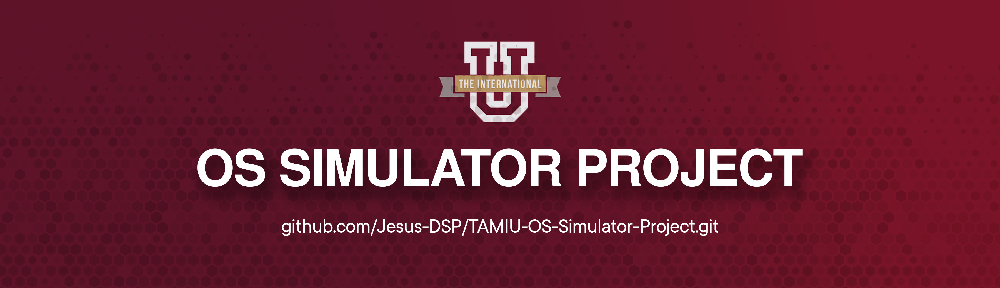

<div align="center">
  <a href="https://github.com/Jesus-DSP/TAMIU-OS-Simulator-Project">
    
  </a>
  <br/>
  <br/>
  <h1>OS Simulator Project</h1>
  <p>A simplified operating system simulator using C++, starting with a basic shell, authentication, and a simulated boot process.</p>
  <br/>

  [Report a Bug](https://github.com/Jesus-DSP/TAMIU-OS-Simulator-Project/issues/new?labels=bug&template=bug_report.md&title=%5BBUG%5D%20)
  ·
  [Request a Feature](https://github.com/Jesus-DSP/TAMIU-OS-Simulator-Project/issues/new?labels=enhancement&template=feature_request.md&title=%5BFEATURE%5D%20)
  ·
  [Ask a Question](https://github.com/Jesus-DSP/TAMIU-OS-Simulator-Project/discussions/new?category=general)
  <br/>
  <br/>
  
  
  [](https://en.cppreference.com/w/cpp/compiler_support)
  [](https://isocpp.org/)
  [](https://github.com/Jesus-DSP/TAMIU-OS-Simulator-Project/commits/main)
</div>


### Why create this basic OS?

This project aims to provide a hands-on learning experience in operating system concepts by building a simplified simulator from the ground up. It allows exploration of fundamental OS components such as user authentication, process management, and memory allocation in a controlled C++ environment.

The initial phase focuses on establishing a solid foundation for future development, ensuring a modular and extensible structure for more complex OS features to be added progressively.

---

## Members

This project was created by: 
- Jesus Salazar
- Humberto Huerta
- Jorge Rodriguez
- Rafael Contreras


---

## Table of Contents

<details>
<summary>Click to expand</summary>

- [Table of Contents](#-table-of-contents)
- [Getting Started](#-getting-started)
    - [Requirements](#requirements)
    - [Installation](#installation)
        - [Download or Clone the Project](#download-or-clone-the-project)
        - [Step 1: Compile the Code](#step-1-compile-the-code)
    - [Config](#config)
        - [.gitignore](#gitignore)
    - [Step 2: Run the Program](#step-2-run-the-program)
- [Changelog](#changelog)
- [Contributing](#contributing)
</details>

---

## Getting Started

To get your copy of the simulation running locally, follow these simple steps.

### Requirements
- **C++ Compiler**: `g++` (or equivalent)
- **Git**: For cloning the repository.
- **make**: (Optional, but recommended for easy compilation).

### Installation

#### Download or Clone the Project

First, clone the repository to your local machine:

```shell
git clone https://github.com/Jesus-DSP/TAMIU-OS-Simulator-Project.git
```

Now cd into the project directory:

```shell
cd TAMIU-OS-Simulator-Project
```

#### Step 1: Compile the Code

This step takes your C++ source files from the `src` directory and uses the `g++` compiler to create a single executable program in the `bin` directory.

First, if the `bin` directory doesn't exist, create it:

```bash
mkdir -p bin
```

Now, run the compilation command:

```bash
g++ src/main.cpp src/auth.cpp -o bin/os_simulator
```

### Config

#### .gitignore

Ensure you have a `.gitignore` file in your root directory to exclude compiled binaries and other unnecessary files from your repository. A minimal `.gitignore` for this project should include:

```gitignore
# Ignore the binary/executable directory
bin/
```

### Step 2: Run the Program

After the command in Step 1 finishes without errors, your program is ready to run. To execute it, you just need to type the path to the new program file.

Run this command:

```bash
./bin/os_simulator
```

Your program will then start running in the terminal.

---

## Changelog

Please see `CHANGELOG.md` for more information on what has changed recently.
(You will need to create this file manually as the project evolves.)

---

## Contributing

Contributions are welcome! Please follow these steps to contribute:

1. Fork the repository.
2. Create your Feature Branch (`git checkout -b feature/AmazingFeature`).
3. Commit your Changes (`git commit -m 'Add some AmazingFeature'`).
4. Push to the Branch (`git push origin feature/AmazingFeature`).
5. Open a Pull Request.

For major changes, please open an issue first to discuss what you would like to change.

Thank you!

---

<p align="right">^ <a href="#os-simulator-project">back to top</a> ^</p>